# Parte 1

Nos disponemos a crear un microservicio de una aplicación web en Azure siguiendo los pasos del [tutorial](https://learn.microsoft.com/en-us/azure/app-service/quickstart-nodejs?tabs=windows&pivots=development-environment-cli) que facilita microsoft.

## Configuración de entorno
+ Creamos una nueva [cuenta](https://azure.microsoft.com/free/?utm_source=campaign&utm_campaign=vscode-tutorial-app-service-extension&mktingSource=vscode-tutorial-app-service-extension) de azure.
+ La instalación de node.js no fué necesaría ya que ambos disponiamos la misma.
  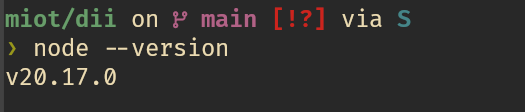
+ Hemos decidido usar Azure CLI por la comodidad de trabajar desde la terminal.
  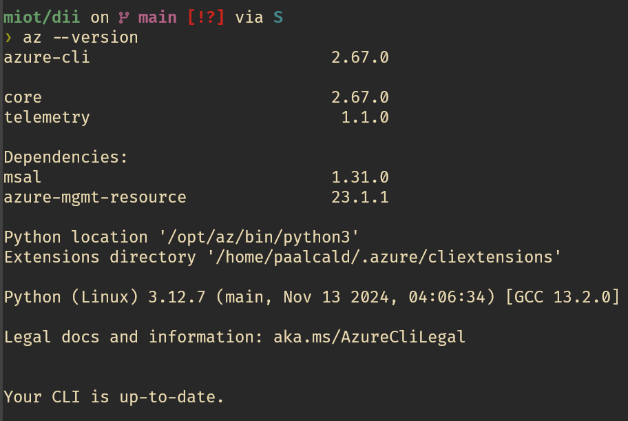
  Tras instalarla nos dispusimos a iniciar sesión en nuestra cuenta de Azure.
  ```{bash}
  az login
  ```
  ```
  A web browser has been opened at https://login.microsoftonline.com/organizations/oauth2/v2.0/authorize. Please continue the login in the web browser. If no web browser is available or if the web browser fails to open, use device code flow with `az login --use-device-code`.
  Opening in existing browser session.
  
  Retrieving tenants and subscriptions for the selection...
  
  [Tenant and subscription selection]
  
  No     Subscription name    Subscription ID                       Tenant
  -----  -------------------  ------------------------------------  ---------------------------------------
  [1] *  Azure for Students   ********-****-****-****-************  Universidad Complutense de Madrid (UCM)
  
  The default is marked with an *; the default tenant is 'Universidad Complutense de Madrid (UCM)' and subscription is 'Azure for Students' (********-****-****-****-************).
  
  Select a subscription and tenant (Type a number or Enter for no changes):
  
  Tenant: Universidad Complutense de Madrid (UCM)
  Subscription: Azure for Students (********-****-****-****-************)
  
  [Announcements]
  With the new Azure CLI login experience, you can select the subscription you want to use more easily. Learn more about it and its configuration at https://go.microsoft.com/fwlink/?linkid=2271236
  
  If you encounter any problem, please open an issue at https://aka.ms/azclibug
  
  [Warning] The login output has been updated. Please be aware that it no longer displays the full list of available subscriptions by default.
  ```

## Creación de la aplicación Node.js

1. Creamos la aplicación usando [Express Generator](https://expressjs.com/starter/generator.html)
    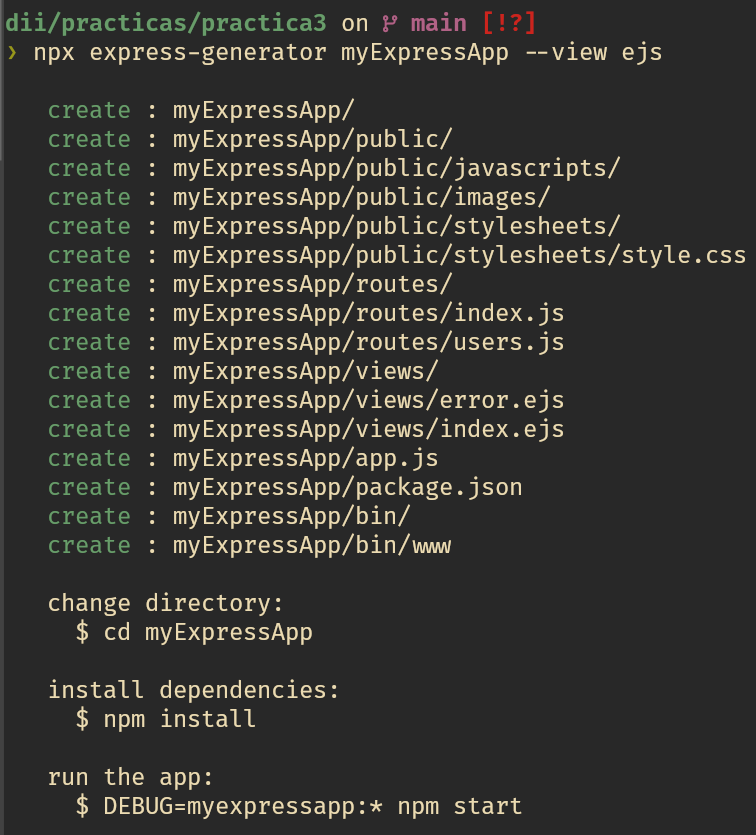
2. Instalamos los paquetes necesarios en el directorio de nuestra nueva aplicación.
    
3. Actualizamos las dependencias a su versión más segura
    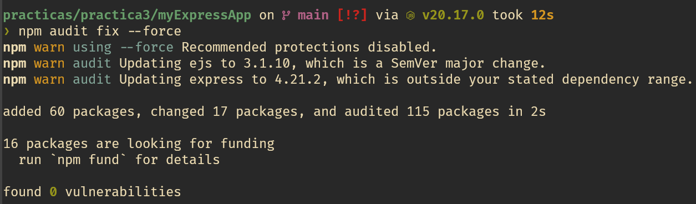
4. Corremos el servidor en local.
    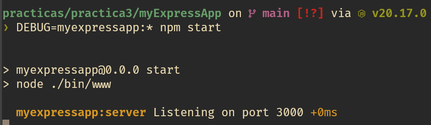
5. Comprobamos el despliegue.
    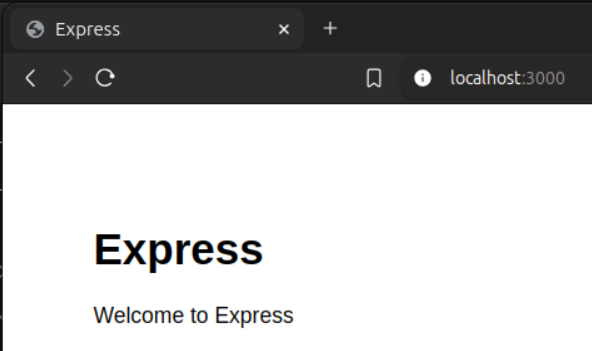
## Desplegar en Azure

Desde la terminal, en el directorio de la aplicación `myEspressApp` ejecutamos el siguiente comando.
```bash
az webapp up --sku F1 --name dii-p3-pd
```
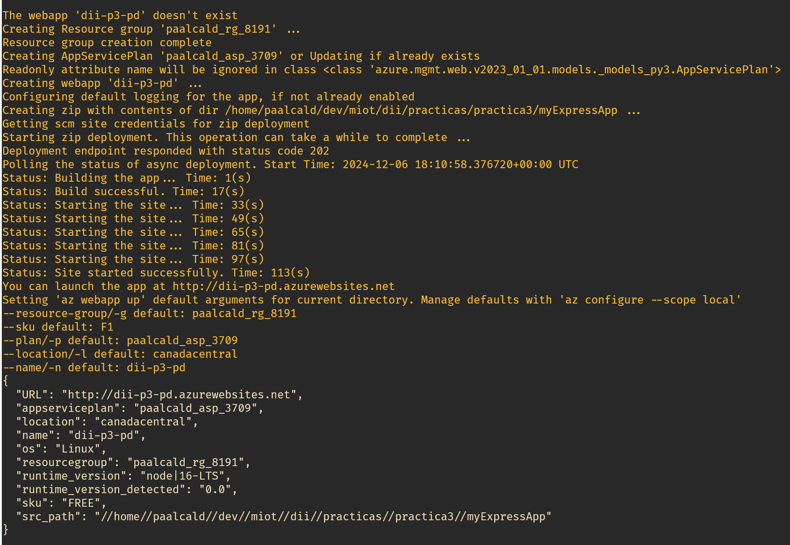

Y podemos observar que el despliegue se realiza correctamente accediendo a la [url](https://dii-p3-pd.azurewebsites.net/)

## Redesplegar

Realizamos en primer lugar las modificaciones solicitadas por el tutorial, cambiando el título por `Azure` y volvemos a desplegar con el siguiente comando:
```bash
az webapp up
```

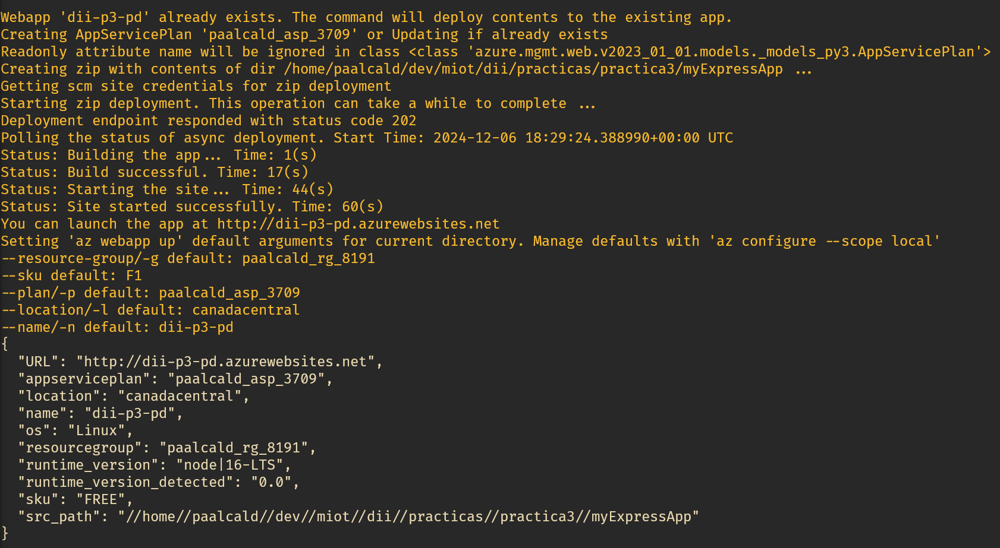
Comprobamos desde nuestro navegador que todo funciona como cabría esperar.
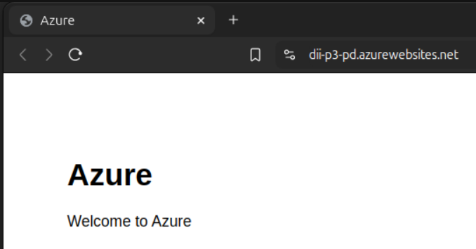
## Redespelgar Curriculum
Aprovechamos que uno de los integrantes de nuestro grupo tiene una web curriculum incompleta y simplemente actualizamos los archivos necesarios para incluirla en nuestra app.

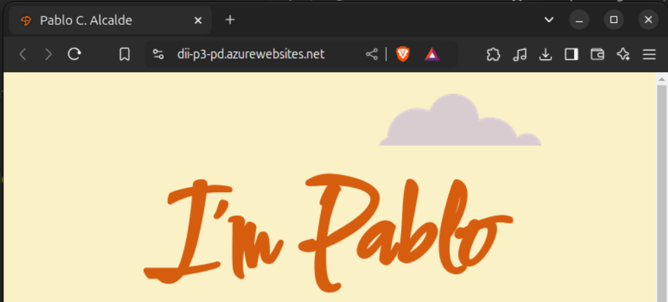
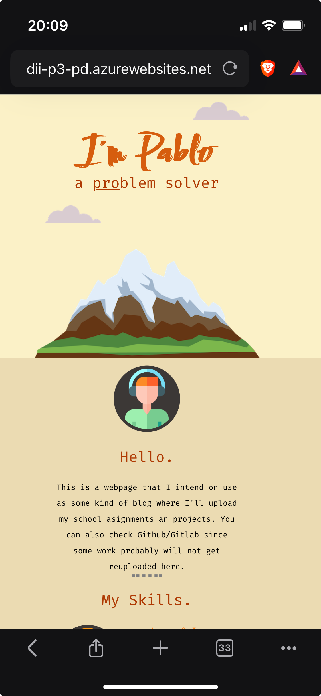

# Parte 2

## Parte 2a
+ Comprobamos nuestros [créditos](https://portal.azure.com/?Microsoft_Azure_Education_correlationId=&Microsoft_Azure_Education_newA4E=true&Microsoft_Azure_Education_asoSubGuid=befdf1fb-e360-4639-8c28-ee1c4cc7ce22#view/Microsoft_Azure_Education/EducationMenuBlade/~/overview)
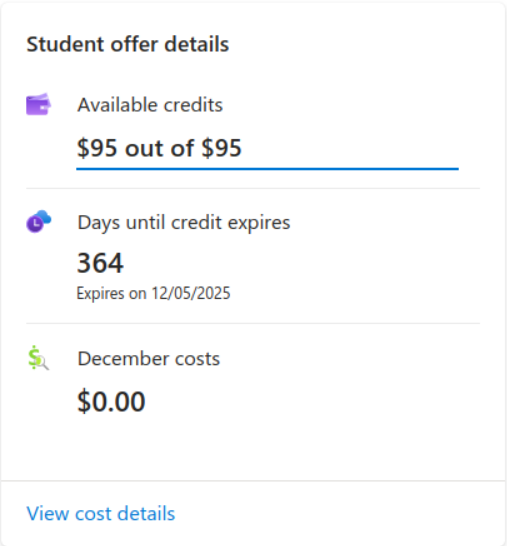
+ Comprobamos que existe un amplio abanico de servicios que son gratuitos hasta alcanzar el límite mensual, especialmente los primeros 12 meses tras crear la cuenta, entre ellos los siguientes nos parecieron interesantes:
  - AI Document Inteligence
  - Azure Database for PostgreSQL
  - Azure DevOps for private git repos.
  - Microsoft IoT Hub up to 8000 messages/day and .5 Kb message meter size.

### Creacion de VM
Vamos a crear una máquina virtual de Linux, las siguientes configuraciones son de nuestro interés.

- Región
  Colocaremos nuestra máquina virtual lo más cerca posible, en este caso en Francia Central.
- Image
  Usaremos Debian 11 "Bullseye".
- Size
  Tomaremos el tamaño de serie.
- Authentication type
  SSH public key para poder entrar usando una clave ssh que generará automáticamente.
- Inbound port rules
  Dejamos abierto el puerto 22 para conexiones SSH como se nos solicita.

### Conexión a la VM
Nos conectamos por ssh tras incluir la clave a nuestro llavero por medio del siguiente comando
```bash
chmod 600 dii-p3-pd.pem
ssh-add dii-p3-pd.pem
```
Acto seguido nos conectamos utilizando nuestro usuario e ip.

Una vez conectados creamos el fichero `prueba.txt` y lo mostramos en pantalla.

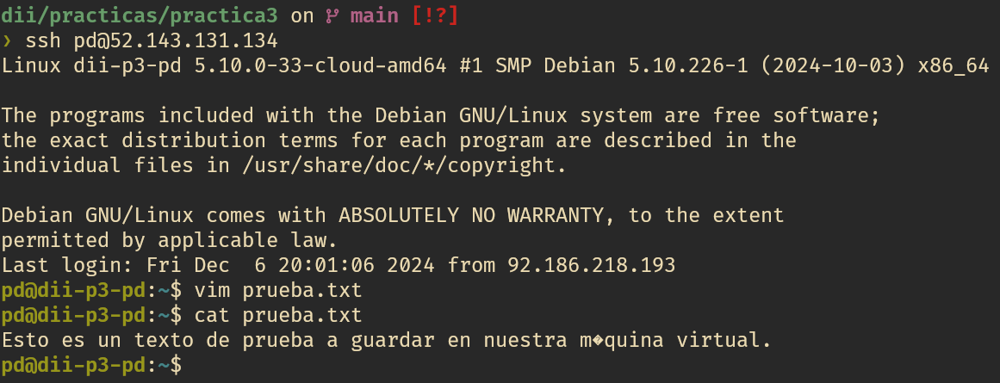
Acto seguido paramos la máquina virtual para evitar costes añadidos.
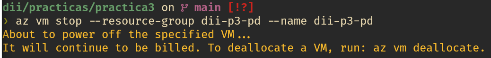
Al ver que lo necesitabamos para evitar costes también ejecutamos el siguiente comando.
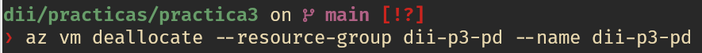
Como observación podemos volver a comenzar nuestra máquina con el siguiente comando:
```bash
az vm start --resource-group dii-p3-pd --name dii-p3-pd
```
